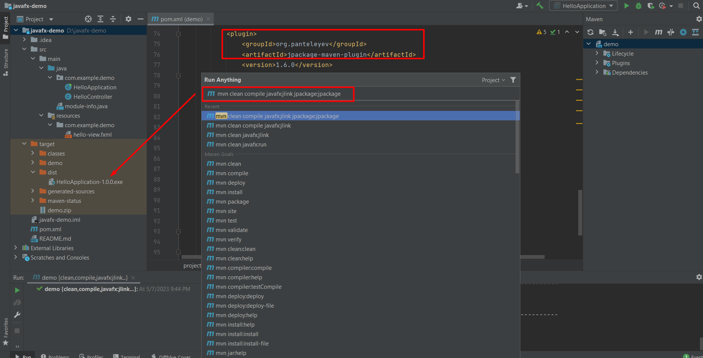

### Maven project
- https://openjfx.io/openjfx-docs/#maven
- Add dependecy (libs): Refer pom.xml
- Config build

  - javafx-maven-plugin, jpackage-maven-plugin -> to build exe
  - Guide link: https://dev.to/cherrychain/javafx-jlink-and-jpackage-h9

- Command
```cmd
mvn clean compile javafx:jlink jpackage:jpackage
```
- Output folder: /target/dist (refer to img below)

### Note

Install WIX Toolset to use jpackage
https://stackoverflow.com/questions/59655362/java-jpackage-native-packaging-wix-tools-not-found-error

Using jdk 14 or 15, 16



